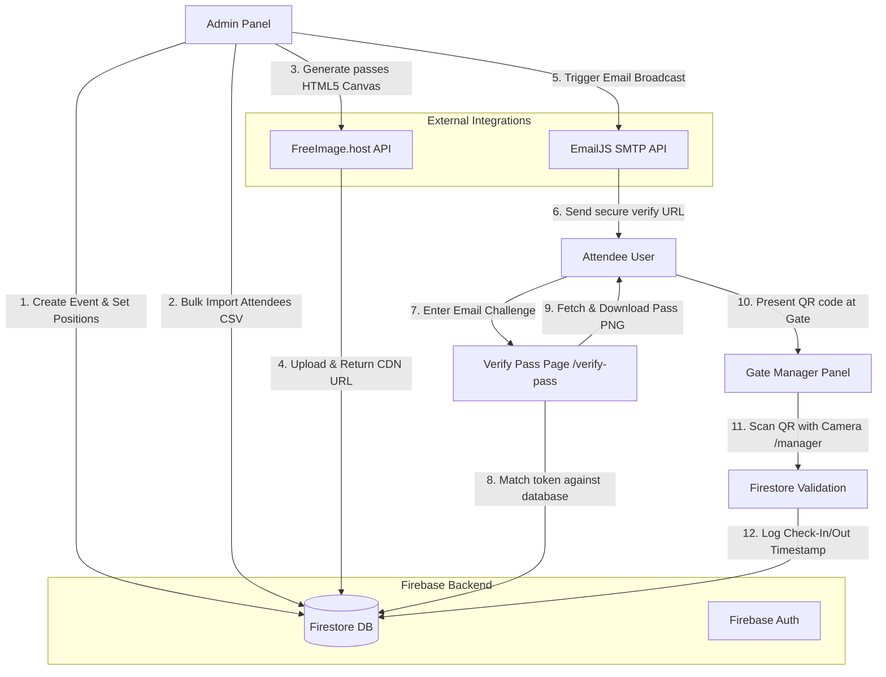

# 🎫 Event Manager – Secure Check-In & Ticket System

[](https://nextjs.org/)
[](https://react.dev/)
[](https://firebase.google.com/)
[](https://tailwindcss.com/)
[](LICENSE)

A modern, fast, and robust event entry management web application built with **Next.js 16**, **React 19**, **Tailwind CSS v4**, and **Firebase (Firestore)**. It enables administrators to visually customize event passes (tickets) with custom QR code and name placements, bulk import attendees via CSV/Excel, email tickets via EmailJS, and check in/out attendees in real time via a camera-based QR code scanner.

---

## 🚀 Key Features

* **🎨 Drag-and-Drop Ticket Customizer**: Upload a background image template and visually position/style both the QR code and the attendee's name directly in the browser. Supports custom sizes, colors, rotations, and fonts.
* **⚡ Real-Time Gates Control (Kiosk/Scanner Mode)**: Event staff can select active events and scan attendee passes via a device camera. Live counters show the number of checked-in guests in real time.
* **📩 Automated Emailing**: Bulk generate and deliver customized pass images with unique verification links directly to attendees' email addresses via EmailJS integration.
* **📥 Import/Export Utilities**: Easily bulk import attendee details from Excel/CSV files and export real-time attendance reports (indicating Check-In, Check-Out, and Absent status) to spreadsheet files.
* **🔒 Role-Based Authorization**: Secure dashboards protected by `RoleGuard` logic to ensure only authenticated Admins can manage events/users, and Managers can run gates check-ins.
* **💎 Neobrutalist UI/UX**: Designed with a high-contrast, premium, responsive layout featuring clean borders, bold colors, and smooth micro-interactions.

---

## 🛠 Tech Stack

* **Framework**: [Next.js](https://nextjs.org/) (App Router, TypeScript)
* **Frontend library**: [React](https://react.dev/)
* **Styling**: [Tailwind CSS](https://tailwindcss.com/)
* **Backend / Database**: [Firebase Firestore & Auth](https://firebase.google.com/)
- **Hosting**: Direct image uploads powered by the [FreeImage.host API](https://freeimage.host/) proxied through Next.js API routes.
* **Email Delivery**: [EmailJS](https://www.emailjs.com/) client integration.
* **Spreadsheet parsing**: [SheetJS (xlsx)](https://sheetjs.com/)

---

## 🏁 Getting Started

### 📋 Prerequisites

Ensure you have the following installed:
* [Node.js](https://nodejs.org/) (v18.x or later recommended)
* [npm](https://www.npmjs.com/) or yarn/pnpm

### ⚙️ Installation

1. **Clone the repository**:
   ```bash
   git clone https://github.com/anshvermadev/Event-Manager-Secure-Check-In-Ticket-System.git
   cd checkin-checkout-system
   ```

2. **Install dependencies**:
   ```bash
   npm install
   ```

3. **Configure Environment Variables**:
   Create a `.env.local` file in the root directory and populate it with your API keys:
   ```env
   # Firebase Config
   NEXT_PUBLIC_FIREBASE_API_KEY=your_firebase_api_key
   NEXT_PUBLIC_FIREBASE_AUTH_DOMAIN=your_firebase_auth_domain
   NEXT_PUBLIC_FIREBASE_DATABASE_URL=your_firebase_database_url
   NEXT_PUBLIC_FIREBASE_PROJECT_ID=your_firebase_project_id
   NEXT_PUBLIC_FIREBASE_STORAGE_BUCKET=your_firebase_storage_bucket
   NEXT_PUBLIC_FIREBASE_MESSAGING_SENDER_ID=your_firebase_messaging_sender_id
   NEXT_PUBLIC_FIREBASE_APP_ID=your_firebase_app_id

   # EmailJS Config
   NEXT_PUBLIC_EMAILJS_SERVICE_ID=your_emailjs_service_id
   NEXT_PUBLIC_EMAILJS_TEMPLATE_ID=your_emailjs_template_id
   NEXT_PUBLIC_EMAILJS_PUBLIC_KEY=your_emailjs_public_key

   # FreeImage.host Config (Optional - Fallback is included)
   NEXT_PUBLIC_FREEIMAGE_API_KEY=your_freeimage_api_key
   ```

4. **Run the Development Server**:
   ```bash
   npm run dev
   ```
   Open [http://localhost:3000](http://localhost:3000) in your browser to view the application.

---

## 📖 Usage Guide

### 1. Setting up Firebase Firestore
This project requires Firestore to store data. Create the following three collections:
* `users`: Store admin and manager profiles with their roles. Example document:
  - Document ID: `<firebase-auth-uid>`
  - Fields: `name` (string), `email` (string), `role` (`"admin"` | `"manager"` | `"user"`).
* `events`: Stores event definitions.
* `attendance`: Stores check-in status per event.

### 2. Administrator Workflow (Admin Dashboard at `/admin`)
* **Create an Event**: Go to **Events** -> **Create Event**. Fill in the name, date, time, and upload a ticket template image (recommended size: `1080x1920px`). Drag the QR Code and Name placeholder to the correct coordinates on the canvas.
* **Import Attendees**: Navigate to **Manage Users** under your event. Click **Import CSV** or download the **Sample CSV** to format your attendee data.
* **Generate Passes**: Click **Generate Passes**. The application will merge the attendee details onto the ticket template using HTML5 Canvas and upload the result to the CDN.
* **Send Emails**: Click **Send Emails** to deliver the unique ticket link to each attendee.

### 3. Attendee Workflow (Ticket Download)
* The attendee receives an email containing a link to `/verify-pass?token=<token>&eventId=<eventId>`.
* Upon entering their email for confirmation, they can view and download their high-resolution pass PNG.

### 4. Gate Controller Workflow (Manager Dashboard at `/manager`)
* Managers or staff log in and select the current active event.
* Use a laptop or mobile camera to scan tickets.
* The scanner parses the QR code. If the ticket is valid, it shows the attendee's name and status.
* Tap **Check In** or **Check Out**. Attendance counters update in real time on the dashboard.

---

## 🔄 System Architecture & Data Flow

This application is built as a serverless event entry ecosystem connecting client-side ticket designer/rendering tools, CDN storage engines, email delivery APIs, and a real-time Firestore database.

### 📐 High-Level Architecture & Flow



### 🗄️ Database Schema & Relationships

1. **`events` (Collection)**: Stores core event rules, layouts, and configurations.
   - `id`: Event Unique ID
   - `name`, `date`, `time`: Event metadata
   - `status`: `'active'` | `'inactive'`
   - `passTemplateURL`: Background template image path
   - `qrPosition`: Object `{ x, y, size, color, bgColor, rotation }`
   - `namePosition`: Object `{ x, y, size, color, font, rotation }`

2. **`events/{eventId}/users` (Subcollection)**: Stores attendee list for a specific event.
   - `id`: Attendee Unique ID
   - `name`, `email`, `branch`, `year`, `section`: Guest details
   - `verificationToken`: Secure UUID used for download authorization
   - `passURL`: Direct public URL to the generated pass image
   - `passConfigHash`: JSON string hash of configuration when generated (helps avoid redundant canvas re-renders)
   - `emailSent`: Boolean indicating if the ticket has been emailed

3. **`attendance/{eventId}/users/{userId}` (Collection)**: Stores gate logs for event audit.
   - `checkInTime`: Firestore ServerTimestamp
   - `checkOutTime`: Firestore ServerTimestamp or `null`

---

## 📩 Ticket Distribution & Verification

The tickets are generated and distributed programmatically via browser-side operations and third-party APIs:

1. **Pass Rendering**: The system reads the event canvas layout parameters. It instantiates an **HTML5 Canvas**, draws the template background, parses and positions the attendee's name (supporting scaling, custom fonts, color values, and rotation offsets), and constructs a custom QR code containing the payload format: `${eventId}_${userId}`.
2. **CORS Safe CDN Upload**: The resulting Canvas layout is converted into a PNG `Blob`. To bypass browser CORS constraints, this is POSTed to the local api proxy `/api/upload` which securely appends credentials and forwards the image to the `FreeImage.host` API to obtain a direct CDN image path.
3. **Email Broadcasting**: Triggering the mail client utilizes `@emailjs/browser` directly in the browser using the public API key. It fires custom event email templates carrying verification links:
   `https://<domain>/verify-pass?token=<token>&eventId=<eventId>`
   *An artificial 500ms delay is executed between batch emails to prevent SMTP API rate-limiting.*
4. **Pass Retrieval & Email Validation**: When an attendee opens their link, they must enter their registered email address. This ensures that even if a link is intercepted, only the authorized attendee can access the download page to obtain their high-resolution pass.

---

## 👥 UX Flow (User Journeys)

```
[ ADMIN JOURNEY ]
   Create Event -> Visual Canvas Setup -> CSV Attendee Import -> Batch Generate -> Send Emails -> Monitor Counters & Export Log

[ ATTENDEE JOURNEY ]
   Open Email Invite -> Complete Secure Verification -> Preview/Download Pass PNG -> Present QR Code at Entry Gate

[ GATE MANAGER JOURNEY ]
   Select Active Event -> Scan QR Code -> View Attendee Profile/Status -> Tap Check-In / Check-Out -> Live Counter Sync
```

### 1. The Admin Experience
* **Visual Setup**: Admin uploads a template (e.g., ticket poster) and moves drag-and-drop handles to visually align where the Guest Name and QR Code will be printed.
* **Bulk Upload**: Import hundreds of guest rows via CSV/Excel in seconds.
* **Smart Generation**: The dashboard shows a "Pass Status" indicator. Clicking "Generate Passes" skips existing valid passes and only builds passes for newly added attendees or if design parameters are modified (detected via config hashing).

### 2. The Attendee Experience
* **Zero-Login Access**: Guests do not need to register accounts. The verification link utilizes the Firestore document ID and UUID verification token to grant direct, secure access to the event ticket.
* **Verification Challenge**: Simple validation step verifies identity by prompting the guest for their email before exposing the ticket file download.

### 3. The Gate Staff Experience
* **Real-time Live Sync**: Multiple managers can scan simultaneously at separate gates. As check-ins are logged, the active headcount counter updates in real time on all manager dashboards using Firestore `onSnapshot` subscriptions.
* **Double-Scan Protection**: The scanner parses the QR payload. If a ticket has already been checked in, it alerts the gate keeper of their current state and prompts for checkout, preventing reuse of identical tickets.

---

## 🤝 Contribution Guidelines

Contributions are welcome! Please read our [CONTRIBUTING.md](CONTRIBUTING.md) to learn how to propose changes, report bugs, or submit pull requests.

To get started with contributions:
1. Fork the Project
2. Create your Feature Branch (`git checkout -b feature/AmazingFeature`)
3. Commit your Changes (`git commit -m 'Add some AmazingFeature'`)
4. Push to the Branch (`git push origin feature/AmazingFeature`)
5. Open a Pull Request

---

## 🛠 Support & Help

If you run into issues or have questions:
* Submit an issue on the [GitHub Issues tracker](https://github.com/anshvermadev/checkin-checkout-system/issues).
* Refer to the Next.js [official documentation](https://nextjs.org/docs) for framework queries.
* Refer to the Firebase [official documentation](https://firebase.google.com/docs) for database/authentication queries.

---

This project is licensed under the terms of the MIT License. See [LICENSE](LICENSE) for details.
